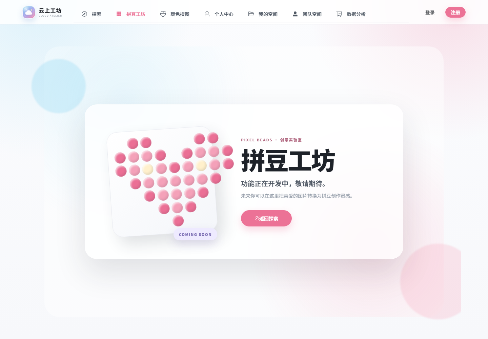

<h1 align="center">云上工坊 · Cloud Atelier</h1>

  

  <strong>遇见灵感，云上造物</strong>

  一个集公共图库浏览、私有素材管理、团队协作与 AI 图片编辑于一体的智能云图库平台。

  <a href="https://cloudatelier.online/"><strong>在线体验</strong></a>
  ·
  <a href="#四快速运行">快速运行</a>
  ·
  <a href="./docs/technical-overview-cn.md">技术概览</a>
  ·
  <a href="./LICENSE.md">开源许可</a>

  
  
  
  
  
  

---

## 一、项目介绍

**云上工坊（Cloud Atelier）** 是一个面向个人创作者和协作团队的全栈智能云图库。游客可以直接探索公共素材；登录后可以建立私有空间、管理团队资产、协同编辑图片，并使用颜色检索、相似图搜索和 AI 扩图等能力完成从发现灵感到整理、加工、分享的完整流程。

线上地址：<https://cloudatelier.online/>

### 为什么做这个项目？

图片素材经常散落在本地文件夹、聊天记录和不同云盘中。传统图库能够完成上传与下载，却很难同时覆盖公开浏览、个人资产沉淀、团队权限、实时协作和 AI 编辑。

云上工坊希望把这些环节连接起来：

- 对游客，提供无需登录即可浏览的公共图库；
- 对个人，提供有配额、有检索能力的私有素材空间；
- 对团队，提供成员角色、权限控制和实时协同编辑；
- 对创作流程，提供裁剪、相似图搜索、颜色搜索、AI 扩图与分享能力。

### 11 大核心能力

1. **游客探索**：默认进入探索页，公共图库、搜索、分类筛选和图片详情无需登录。
2. **公共图库**：支持分类、关键词、标签、排序、分页、图片预览与审核发布流程。
3. **私有空间**：每位用户最多创建一个私有空间，集中上传、编辑和管理个人图片。
4. **团队空间**：支持成员邀请、角色管理，以及管理员、编辑者、浏览者三级 RBAC 权限。
5. **实时协作**：通过 WebSocket 同步协作状态，结合 Redis 编辑锁与 RabbitMQ 消息缓冲。
6. **AI 图片扩展**：接入阿里云百炼图像画面扩展，支持比例、缩放和偏移等扩图参数。
7. **以图搜图**：聚合 Bing Visual Search 与百度识图，并支持超时、单源失败和未配置源降级。
8. **颜色搜图**：上传时提取图片主色调，按 RGB 欧氏距离检索相近颜色素材。
9. **图库分析**：使用 ECharts 展示图片、容量、下载、分类、趋势、排行和标签等真实数据。
10. **图片创作工具**：支持上传前裁剪、链接与二维码分享、登录后下载和图片信息编辑。
11. **拼豆工坊（开发中）**：提供公开的拼豆创作入口与像素拼豆视觉预告，后续将围绕图片网格化和拼豆创作辅助继续完善。

## 二、项目优势 / 技术亮点

云上工坊不仅实现了常规的图片 CRUD，还覆盖了公共内容、私有资产、团队协作、实时通信、智能检索和外部 AI 服务接入等完整业务链路。

### 1. 游客浏览与操作触发登录

- 公共列表和已审核图片详情对游客开放。
- 上传、下载、空间、团队、AI 编辑等操作统一经过全局认证门。
- 登录成功后自动恢复原路由或继续原操作，取消登录则保留当前浏览位置。
- 会话过期时最多重试原请求一次，避免重复弹窗和无限重放。

### 2. 公共图库与空间数据隔离

- 公共图库只返回已审核、未删除且不属于任何空间的图片。
- 私有空间按用户隔离，团队空间按成员关系与角色校验。
- 每位用户仅能创建一个私有空间，业务约束在服务层统一执行。
- 图片上传限制为 **JPEG / PNG / WebP / GIF，单文件不超过 10 MB**。

### 3. 轻量 RBAC 与实时协同编辑

- 团队空间提供 <code>admin</code>、<code>editor</code>、<code>viewer</code> 三种角色。
- 权限校验覆盖成员管理、图片管理、空间设置与协同编辑。
- WebSocket 负责在线状态和编辑消息，Redis 提供编辑锁，RabbitMQ 用于消息缓冲。
- Redis 或消息组件异常时提供受控降级，避免单个基础设施故障拖垮全部请求。

### 4. 多级缓存与请求治理

- L1 使用进程内存缓存，L2 使用 Redis，降低热点图片和公共列表的数据库压力。
- 热点访问达到阈值后可提升到本地缓存，并按列表、详情和排序场景设置不同 TTL。
- 写操作完成后主动失效相关缓存，用户维度的实时分析数据不使用易产生脏数据的长缓存。
- 提供按层级和路径配置的限流能力，并支持 Redis 不可用时 fail-open。

### 5. 可降级的外部能力

- 以图搜图采用门面模式并发调用多个搜索源，单源超时或失败不会影响其他来源。
- Bing 仅在配置 API Key 后启用；百度识图属于外部抓取接口，可能受到反爬或接口变更影响。
- AI 扩图封装为“创建异步任务 + 轮询任务结果”，隔离第三方协议和错误格式。
- 腾讯云 COS 负责原图存储，Pillow 负责格式、尺寸和完整性校验。

### 6. 可学习的全栈技术

| 方向 | 技术与实践 |
| --- | --- |
| 前端工程 | Vue 3、TypeScript、Vite、Pinia、Vue Router、Axios、Element Plus |
| 数据可视化 | ECharts、词云、响应式仪表盘、减少动态效果适配 |
| 后端架构 | FastAPI、Pydantic v2、SQLAlchemy 2.0、FastCRUD、异步数据库访问 |
| 数据与迁移 | PostgreSQL 16、asyncpg、Alembic、JSONB 标签聚合 |
| 缓存与限流 | cachetools L1、Redis L2、热点提升、缓存失效、分级限流 |
| 安全认证 | 服务端 Session、Redis 会话、CSRF、管理员权限、团队 RBAC |
| 实时协作 | WebSocket、RabbitMQ、Redis 分布式编辑锁 |
| 图片处理 | Pillow、Cropper.js、腾讯云 COS、主色调提取 |
| 智能能力 | 阿里云百炼扩图、Bing / 百度相似图搜索、颜色距离检索 |
| 工程交付 | uv workspace、Pytest、Ruff、Mypy、Docker Compose、Nginx、HTTPS |

### 7. 已实现的配额规则

| 空间等级 | 私有空间 | 团队空间 |
| --- | ---: | ---: |
| 普通版 | 500 MB / 100 张 | 2.5 GB / 500 张 |
| 专业版 | 5 GB / 1,000 张 | 25 GB / 5,000 张 |
| 旗舰版 | 10 GB / 3,000 张 | 50 GB / 15,000 张 |

> 配额数据来自当前代码配置。仓库暂未发布标准化并发量或响应时延基准，因此不提供未经复现实验的性能数字。

## 三、功能模块

| 模块 | 主要能力 | 访问要求 |
| --- | --- | --- |
| 探索页 | 公共图片瀑布流、搜索、分类、排序、分页 | 游客可用 |
| 拼豆工坊（开发中） | 拼豆像素创作入口与功能预告，当前开放独立展示页 | 游客可查看 |
| 图片详情 | 大图预览、规格、标签、简介、分享 | 游客可查看；下载需登录 |
| 图片管理 | 上传、裁剪、编辑、删除、审核、拒绝原因 | 登录 / 管理员 |
| 私有空间 | 空间创建、配额、图册、图片详情、个人分析 | 登录 |
| 团队空间 | 团队创建、成员管理、角色权限、共享图册 | 登录并加入团队 |
| 协同编辑 | 在线成员、编辑锁、缩放、旋转、裁剪状态同步 | 团队权限 |
| 颜色搜图 | 目标色选择、主色匹配、距离排序 | 登录且已有私有空间 |
| 以图搜图 | Bing / 百度多源相似图片结果 | 登录；依赖外部搜索源 |
| AI 扩图 | 创建百炼任务、轮询状态、预览扩图结果 | 登录；依赖百炼配置 |
| 数据中心 | 管理端全局分析、用户空间分析、趋势与排行 | 登录 / 管理员 |
| 用户中心 | 资料、头像、简介、身份信息与账号状态 | 登录 |
| 分享工具 | 复制链接、生成二维码 | 公共详情可用 |

### 系统架构

~~~mermaid
flowchart TB
    subgraph Roles["访问角色"]
        direction LR
        Visitor([游客])
        User([注册用户])
        Admin([管理员])
    end

    subgraph Delivery["接入与展示层"]
        direction LR
        Nginx["Nginx · HTTPS 静态资源与反向代理"]
        Web["Vue 3 + TypeScript Element Plus · Pinia · ECharts"]
    end

    subgraph Application["应用服务层 · FastAPI"]
        direction LR
        API["异步 REST API Session · CSRF · RBAC"]
        Gallery["图库与空间服务 审核 · 配额 · 分析"]
        Smart["智能图片服务 扩图 · 相似图 · 颜色检索"]
        WS["WebSocket 协同服务 在线状态 · 编辑锁"]
    end

    subgraph Infrastructure["数据与基础设施"]
        direction LR
        PG[("PostgreSQL 16 业务数据")]
        Redis[("Redis 7 会话 · 缓存 · 限流 · 锁")]
        MQ[("RabbitMQ 3 协作消息缓冲")]
    end

    subgraph Cloud["云存储与外部能力"]
        direction LR
        COS[("腾讯云 COS 图片对象存储")]
        Bailian["阿里云百炼 AI 画面扩展"]
        Search["Bing + 百度 相似图搜索"]
    end

    Visitor & User & Admin --> Nginx
    Nginx -->|静态资源| Web
    Nginx -->|/api 反向代理| API
    Nginx -->|WebSocket 升级| WS
    Web -.->|REST · Cookie Session| API
    Web -.->|实时编辑消息| WS
    API --> Gallery & Smart
    Gallery --> PG & Redis & COS
    Smart --> Redis & COS & Bailian & Search
    WS --> Redis & MQ

    classDef role fill:#fff7fb,stroke:#ed6f9b,color:#272a35,stroke-width:1.5px;
    classDef frontend fill:#eefaff,stroke:#71c7df,color:#202735,stroke-width:1.5px;
    classDef service fill:#fff4f8,stroke:#ed7ca4,color:#202735,stroke-width:1.5px;
    classDef data fill:#f5f1ff,stroke:#9b8de3,color:#202735,stroke-width:1.5px;
    classDef cloud fill:#f0fbf7,stroke:#69bea2,color:#202735,stroke-width:1.5px;
    class Visitor,User,Admin role;
    class Nginx,Web frontend;
    class API,Gallery,Smart,WS service;
    class PG,Redis,MQ data;
    class COS,Bailian,Search cloud;
    style Roles fill:#fffafd,stroke:#f4c7d8,stroke-width:1px
    style Delivery fill:#f8fdff,stroke:#b9e4ef,stroke-width:1px
    style Application fill:#fff9fb,stroke:#f4c7d8,stroke-width:1px
    style Infrastructure fill:#fbf9ff,stroke:#d6cef5,stroke-width:1px
    style Cloud fill:#f8fdfb,stroke:#c3e8da,stroke-width:1px
~~~

> **拼豆工坊路线图：** 当前版本已提供公开入口和视觉预告页。规划中的创作能力包括图片像素网格化、配色参考与拼豆制作辅助；在功能正式完成前，页面不会展示虚构的上线时间或不可用操作。

## 四、快速运行

### 1. 前置条件

| 工具或服务 | 推荐版本 | 用途 |
| --- | --- | --- |
| Git | 最新稳定版 | 克隆与版本管理 |
| Python | 3.11+ | 后端运行环境 |
| uv | 最新稳定版 | Python workspace 与依赖管理 |
| Node.js | 20.19+ 或 22.12+ | 前端开发与构建（Vite 8 要求） |
| PostgreSQL | 16 | 主数据库 |
| Redis | 7 | Session、缓存、限流和编辑锁 |
| RabbitMQ | 3 Management | 团队协作消息缓冲 |
| Docker | 可选 | 快速启动 PostgreSQL、Redis、RabbitMQ |

图片上传需要腾讯云 COS 配置；AI 扩图和 Bing 以图搜图分别需要对应的第三方凭据。未配置这些可选服务时，其余基础功能仍可独立开发和调试。

### 2. 克隆项目并安装依赖

~~~bash
git clone https://github.com/Mrlfighting/cloudstudio.git
cd cloudstudio

# 安装后端、CLI 和开发依赖
uv sync --all-packages --all-extras

# 安装前端依赖
cd frontend
npm ci
cd ..
~~~

### 3. 启动基础设施

如果本机已经安装 PostgreSQL、Redis 和 RabbitMQ，可以跳过本节。也可以使用 Docker 快速启动本地开发实例：

~~~bash
docker run -d --name cloudatelier-postgres \
  -e POSTGRES_USER=postgres \
  -e POSTGRES_PASSWORD=postgres \
  -e POSTGRES_DB=postgres \
  -p 5432:5432 \
  postgres:16-alpine

docker run -d --name cloudatelier-redis \
  -p 6379:6379 \
  redis:7-alpine

docker run -d --name cloudatelier-rabbitmq \
  -e RABBITMQ_DEFAULT_USER=guest \
  -e RABBITMQ_DEFAULT_PASS=guest \
  -p 5672:5672 \
  -p 15672:15672 \
  rabbitmq:3-management-alpine
~~~

> 上述账号仅用于本地开发。生产环境必须使用强密码、限制端口暴露并配置持久化数据卷。

### 4. 配置环境变量

本地直接运行后端时，配置模块读取仓库根目录的 <code>.env</code>：

~~~bash
cp backend/.env.example .env
uv run bp env gen-secret
~~~

将生成的密钥和本地服务地址写入 <code>.env</code>。以下是运行核心功能需要重点检查的配置：

~~~dotenv
ENVIRONMENT=local
SECRET_KEY=替换为随机长密钥

POSTGRES_USER=postgres
POSTGRES_PASSWORD=postgres
POSTGRES_DB=postgres
POSTGRES_SERVER=localhost
POSTGRES_PORT=5432

CACHE_BACKEND=redis
CACHE_REDIS_HOST=localhost
RATE_LIMITER_REDIS_HOST=localhost
SESSION_BACKEND=redis
SESSION_SECURE_COOKIES=false

TASKIQ_REDIS_HOST=localhost

IMAGE_COLLAB_ENABLED=true
COLLAB_RABBITMQ_HOST=localhost
COLLAB_RABBITMQ_PORT=5672
COLLAB_RABBITMQ_USER=guest
COLLAB_RABBITMQ_PASSWORD=guest

ADMIN_NAME=管理员
ADMIN_EMAIL=admin@example.com
ADMIN_USERNAME=admin
ADMIN_PASSWORD=替换为强密码
~~~

外部图片与智能能力配置：

| 变量 | 是否必需 | 说明 |
| --- | :---: | --- |
| <code>COS_SECRET_ID</code> / <code>COS_SECRET_KEY</code> | 上传必需 | 腾讯云 API 凭据 |
| <code>COS_REGION</code> / <code>COS_BUCKET</code> | 上传必需 | COS 地域和存储桶 |
| <code>COS_DOMAIN</code> | 可选 | 自定义图片访问域名，留空使用 COS 默认域名 |
| <code>IMAGE_OUTPAINTING_API_KEY</code> | AI 扩图必需 | 阿里云百炼 API Key |
| <code>IMAGE_OUTPAINTING_WORKSPACE_ID</code> | AI 扩图必需 | 百炼业务空间 ID |
| <code>IMAGE_SEARCH_BING_ENABLED</code> | 可选 | 是否启用 Bing Visual Search |
| <code>IMAGE_SEARCH_BING_API_KEY</code> | Bing 必需 | Bing Visual Search API Key |
| <code>IMAGE_SEARCH_BAIDU_ENABLED</code> | 可选 | 是否尝试使用百度识图外部接口 |

前端开发环境默认使用 <code>/api/v1</code>，Vite 会把 <code>/api</code> 代理到 <code>http://localhost:8000</code>，通常不需要额外修改。

> Session 复用 <code>CACHE_REDIS_HOST</code>、<code>CACHE_REDIS_PORT</code> 和 <code>CACHE_REDIS_DB</code> 建立 Redis 连接，无需单独配置 Session Redis 地址。

### 5. 初始化数据库并启动后端

终端一：

~~~bash
cd backend

# 执行数据库迁移
uv run alembic upgrade head

# 创建默认层级和管理员
uv run python -m scripts.setup_initial_data

# 启动 FastAPI 开发服务器
uv run fastapi dev src/interfaces/main.py
~~~

如需启动 Taskiq 后台任务 Worker，可在新终端执行：

~~~bash
cd backend
uv run taskiq worker infrastructure.taskiq.worker:default_broker
~~~

### 6. 启动前端

终端二：

~~~bash
cd frontend
npm run dev
~~~

### 7. 本地访问地址

| 服务 | 地址 |
| --- | --- |
| 前端页面 | <http://localhost:5173> |
| 后端 API | <http://localhost:8000> |
| Swagger 文档 | <http://localhost:8000/docs> |
| ReDoc 文档 | <http://localhost:8000/redoc> |
| 健康检查 | <http://localhost:8000/health> |
| RabbitMQ 管理页 | <http://localhost:15672> |
| PostgreSQL | <code>localhost:5432</code>，可使用 DBeaver 或 pgAdmin 连接 |

### 8. 常用校验命令

~~~bash
# 后端测试与静态检查
cd backend
uv run pytest
uv run ruff check src tests
uv run mypy src --config-file pyproject.toml

# 前端类型检查与生产构建
cd ../frontend
npm run build
~~~

更多底层设计可阅读 [技术概览](./docs/technical-overview-cn.md) 和 <code>docs/</code> 目录。

## 五、项目截图

### 探索页

游客无需登录即可搜索、筛选和浏览公共图库；需要身份的操作会在原页面唤起登录弹窗。

<table>
  <tr>
    <td width="50%" valign="top">
      <strong>图片详情</strong> 
      在同一页面查看高清预览、分类、标签、尺寸、格式与素材简介。
        
      
    </td>
    <td width="50%" valign="top">
      <strong>拼豆工坊</strong> 
      面向像素拼豆创作的独立入口，当前版本展示开发预告与产品视觉。
        
      
    </td>
  </tr>
</table>

## 六、目录结构

~~~text
cloudstudio/
├── backend/
│   ├── src/
│   │   ├── interfaces/          # FastAPI 入口、API 路由与管理界面
│   │   ├── modules/             # 用户、图片、空间、团队、分析等业务模块
│   │   └── infrastructure/      # 数据库、缓存、认证、图片搜索、AI、协作等基础设施
│   ├── migrations/              # Alembic 数据库迁移
│   ├── scripts/                 # 初始化管理员和默认层级
│   ├── tests/                   # 单元测试与集成测试
│   ├── .env.example             # 后端环境变量示例
│   └── pyproject.toml
├── frontend/
│   ├── public/                  # favicon 等静态资源
│   ├── src/
│   │   ├── api/                 # Axios 请求封装
│   │   ├── components/          # 通用组件与业务弹窗
│   │   ├── layouts/             # 页面布局
│   │   ├── router/              # 路由和权限守卫
│   │   ├── stores/              # Pinia 状态管理
│   │   ├── types/               # TypeScript 类型
│   │   └── views/               # 公共图库、空间、团队和管理页面
│   ├── package.json
│   └── vite.config.ts
├── cli/                         # bp 工程 CLI 与部署模板生成器
├── docs/                        # 架构、使用说明与开发交接
├── memory/                      # 本地开发记忆与约束记录
├── pyproject.toml               # uv workspace 配置
├── uv.lock                      # Python 依赖锁文件
└── README.md
~~~

后端采用纵向切片组织业务：每个模块就近维护模型、Schema、服务与路由；通用技术能力集中在 <code>infrastructure/</code>，便于替换缓存、消息队列和外部图片服务。

## 七、部署说明

线上站点采用以下部署结构：

- Linux 服务器运行 Docker Compose；
- PostgreSQL 16、Redis 7、RabbitMQ 3 以独立容器运行并持久化数据；
- FastAPI 容器启动前执行 Alembic 数据库迁移；
- Vue 生产产物由 Nginx 托管；
- Nginx 将 HTTP 重定向到 HTTPS，并反向代理 <code>/api/</code> 与 WebSocket；
- 图片文件保存到腾讯云 COS；
- 生产域名为 <code>cloudatelier.online</code>。

仓库维护独立的 <code>deploy</code> 分支，用于保留运行必需文件并移除测试、开发文档和本地记忆。当前采用手动发布流程：

~~~bash
# 服务器
git fetch origin
git switch deploy
git pull --ff-only origin deploy

# 使用服务器上已有的生产 Compose 配置重新构建并启动
docker compose up -d --build
docker compose ps
~~~

生产环境的 <code>.env</code>、COS / AI 密钥、数据库密码和 TLS 证书不提交到 Git。首次部署前需要在服务器完成这些配置，并确认：

1. <code>ENVIRONMENT=production</code>；
2. 使用随机 <code>SECRET_KEY</code>、管理员强密码和数据库强密码；
3. <code>SESSION_SECURE_COOKIES=true</code>；
4. <code>CORS_ORIGINS</code> 仅允许真实域名；
5. Nginx 正确转发 WebSocket 的 <code>Upgrade</code> 与 <code>Connection</code> 请求头；
6. <code>/health</code> 返回 <code>{"status":"healthy"}</code>；
7. 数据库迁移成功后再开放流量。

GitHub Actions 当前只支持手动触发，push 不会自动部署生产站点。

## 八、致谢 / 许可

本项目基于 [Fastro / FastAPI Boilerplate](https://github.com/benavlabs/FastAPI-boilerplate) 演进，感谢以下开源项目和服务：

- [FastAPI](https://fastapi.tiangolo.com/) 与 [SQLAlchemy](https://www.sqlalchemy.org/)
- [Vue.js](https://vuejs.org/)、[Element Plus](https://element-plus.org/) 与 [ECharts](https://echarts.apache.org/)
- [PostgreSQL](https://www.postgresql.org/)、[Redis](https://redis.io/) 与 [RabbitMQ](https://www.rabbitmq.com/)
- [Cropper.js](https://github.com/fengyuanchen/cropperjs) 与 [qrcode.vue](https://github.com/scopewu/qrcode.vue)
- 腾讯云 COS、阿里云百炼、Bing Visual Search 等外部能力

本项目采用 [MIT License](./LICENSE.md) 开源。使用第三方云服务和搜索接口时，请同时遵守对应平台的服务条款、配额与内容规范。

如果这个项目对你有帮助，欢迎 Star、Fork 或提交 Issue。
