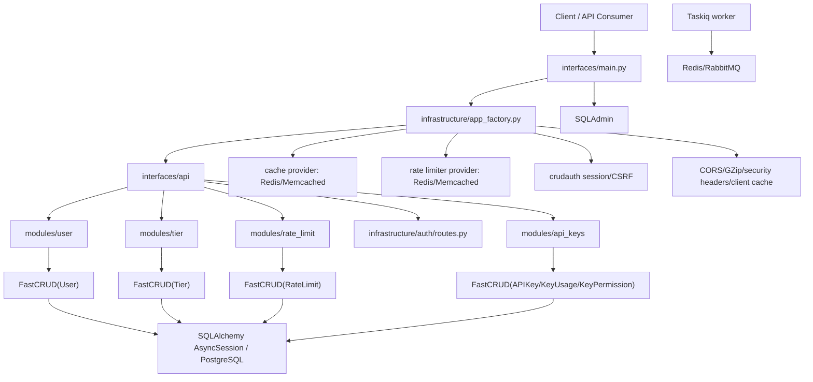
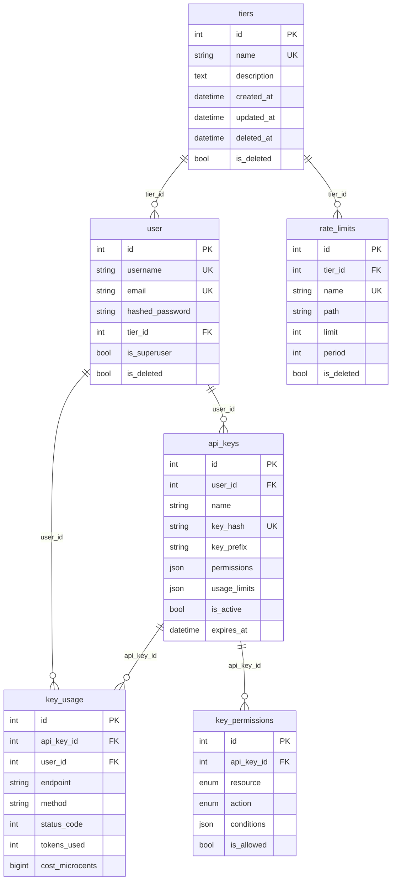
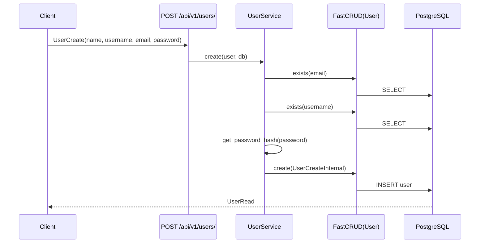
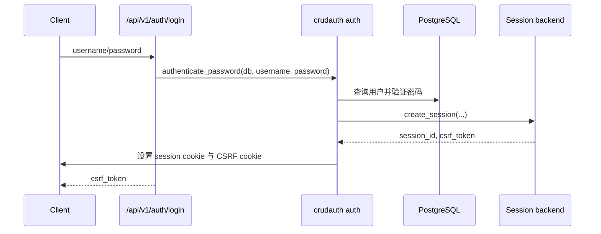

# Fastro 技术概览与新人学习文档

> 本文基于当前仓库代码与文档整理，重点面向新人学习和二次开发。已确认的信息来自 `README.md`、`pyproject.toml`、`backend/src`、`backend/scripts`、`backend/migrations`、`cli/src` 与现有 `docs/` 内容。未在代码中确认的内容不会作为既有事实描述。

## 1. 项目简介与技术栈

### 1.1 项目定位

本项目是一个 batteries-included 的 FastAPI 后端模板，项目名在 README 中称为 Fastro。它提供一套可直接扩展的异步 API 后端基础设施，包括：

- FastAPI 应用工厂与统一入口。
- PostgreSQL + SQLAlchemy 2.0 异步数据库访问。
- 基于 `crudauth` 的服务端 Session、CSRF、密码登录和 Google OAuth。
- 基于 `FastCRUD` 的通用 CRUD 与分页。
- 用户、层级、限流、API Key 等垂直切片模块。
- Redis 或 Memcached 缓存与限流后端。
- Taskiq 后台任务队列，支持 Redis 或 RabbitMQ broker。
- SQLAdmin 管理后台。
- `bp` CLI，用于生成部署文件、校验环境变量和承载插件扩展。

仓库是一个 `uv` workspace：

- 根目录 `pyproject.toml` 只负责 workspace 元数据，不是部署包。
- `backend/` 是实际部署的 FastAPI 应用。
- `cli/` 是开发者/运维辅助命令行工具，不进入生产镜像主体。

### 1.2 主要技术栈

| 类型 | 技术 |
| --- | --- |
| Web 框架 | FastAPI |
| 数据校验 | Pydantic v2, pydantic-settings |
| ORM | SQLAlchemy 2.0 async |
| 数据库 | PostgreSQL，测试/本地也包含 aiosqlite 依赖 |
| 迁移 | Alembic |
| CRUD | FastCRUD |
| 认证 | crudauth, Starlette SessionMiddleware |
| OAuth | crudauth OAuth，当前代码中 Google OAuth 已接入 |
| 缓存 | Redis 或 Memcached |
| 限流 | Redis 或 Memcached 后端，按 tier/path 配置 |
| 后台任务 | Taskiq, taskiq-redis, taskiq-aio-pika |
| 管理后台 | SQLAdmin |
| CLI | Typer, Jinja2 |
| 测试 | pytest, pytest-asyncio, httpx, testcontainers-postgres |
| 代码质量 | Ruff, mypy, pre-commit |
| 包管理 | uv workspace |

### 1.3 运行入口

后端入口是 `backend/src/interfaces/main.py`：

- 调用 `create_application(...)` 创建 FastAPI 实例。
- 挂载 `/api/v1/*` API 路由。
- 添加 `SessionMiddleware`。
- 初始化 SQLAdmin 管理后台。
- 提供 `/health` 健康检查。
- 在 lifespan 中执行生产安全校验、数据库/缓存/限流/auth 初始化与关闭。

API 路由前缀链路：

```text
/api
  /v1
    /users
    /tiers
    /rate-limits
    /auth
    /api-keys
```

## 2. 功能模块列表及关系

### 2.1 模块总览

| 模块 | 路径 | 职责 |
| --- | --- | --- |
| 应用接口层 | `backend/src/interfaces` | FastAPI 入口、API 路由聚合、SQLAdmin 初始化与后台视图 |
| 基础设施层 | `backend/src/infrastructure` | 配置、数据库、认证、缓存、限流、Taskiq、日志、中间件、安全校验 |
| 用户模块 | `backend/src/modules/user` | 用户注册、查询、更新、软删除、GDPR 匿名化、tier 关联 |
| Tier 模块 | `backend/src/modules/tier` | 用户层级分类，供限流和业务扩展引用 |
| Rate Limit 模块 | `backend/src/modules/rate_limit` | 维护 tier/path 的限流配置 |
| API Key 模块 | `backend/src/modules/api_keys` | API Key 创建、查询、更新、禁用、验证、使用记录与分析 |
| Common 模块 | `backend/src/modules/common` | 共享异常、响应 schema、错误处理、常量和工具 |
| CLI 工具 | `cli/src/cli` | `bp` 命令、部署模板生成、环境校验、插件发现 |

### 2.2 主要依赖关系



### 2.3 垂直切片约定

现有业务模块基本遵循同一结构：

```text
modules/<feature>/
├── models.py        # SQLAlchemy 表模型
├── schemas.py       # Pydantic 请求/响应模型
├── crud.py          # FastCRUD 实例
├── service.py       # 业务规则与事务编排
├── routes.py        # FastAPI 路由
├── dependencies.py  # Service 依赖注入别名
└── enums.py         # 可选：枚举
```

新增业务功能时，优先按这个结构新增一个 `modules/<feature>/`，而不是把同一功能拆散到多个顶层目录。

## 3. 目录结构与核心类说明

### 3.1 顶层结构

```text
FastAPI-boilerplate/
├── backend/                 # 可部署 FastAPI 应用
│   ├── src/
│   │   ├── interfaces/       # HTTP/API/Admin 接口层
│   │   ├── infrastructure/   # 横向基础设施
│   │   └── modules/          # 垂直业务模块
│   ├── migrations/           # Alembic 配置与版本目录
│   ├── scripts/              # 初始化脚本
│   ├── tests/                # 单元测试与集成测试
│   ├── Dockerfile
│   ├── alembic.ini
│   └── pyproject.toml
├── cli/                      # bp 命令行工具
│   ├── src/cli/
│   └── pyproject.toml
├── docs/                     # 项目文档
├── pyproject.toml            # uv workspace 根配置
└── uv.lock
```

### 3.2 `interfaces`

| 文件 | 说明 |
| --- | --- |
| `interfaces/main.py` | 应用入口，创建 app、添加 SessionMiddleware、SQLAdmin、`/health` |
| `interfaces/api/__init__.py` | 挂载 `/api` 总路由 |
| `interfaces/api/v1/__init__.py` | 聚合 `/users`、`/tiers`、`/rate-limits`、`/auth`、`/api-keys` |
| `interfaces/admin/initialize.py` | 创建 SQLAdmin 实例并注册视图 |
| `interfaces/admin/auth.py` | SQLAdmin 登录认证，使用 `ADMIN_USERNAME`/`ADMIN_PASSWORD` |
| `interfaces/admin/views/users.py` | User 管理视图，创建时哈希密码，删除时执行匿名化 |
| `interfaces/admin/views/tiers.py` | Tier 管理视图 |

### 3.3 `infrastructure`

| 文件/目录 | 核心对象 | 说明 |
| --- | --- | --- |
| `app_factory.py` | `create_application`, `lifespan_factory` | 创建 FastAPI app，挂载中间件，初始化/关闭 cache、rate limiter、auth |
| `config/settings.py` | `Settings` | 汇总环境、数据库、缓存、限流、认证、CORS、日志、Taskiq 等配置 |
| `database/session.py` | `engine`, `local_session`, `Base`, `async_session`, `create_tables` | 异步 SQLAlchemy 引擎、Session 依赖、模型基类 |
| `database/models.py` | `TimestampMixin`, `SoftDeleteMixin`, `UUIDMixin` | 通用模型字段 mixin |
| `auth/setup.py` | `auth = CRUDAuth(...)` | crudauth 组合根，配置 SessionTransport、CSRF、登录限流 |
| `auth/dependencies.py` | `get_current_user`, `get_current_superuser` | 认证/鉴权依赖，返回现有路由使用的 dict 用户对象 |
| `auth/routes.py` | 登录、登出、刷新 CSRF、Google OAuth、检查登录态 | 认证 API |
| `cache/*` | `cache_provider`, `@cache` | Redis/Memcached 缓存后端、缓存装饰器 |
| `rate_limit/*` | `rate_limiter_provider`, `check_rate_limit`, `RateLimiterMiddleware` | 限流后端与限流检查逻辑 |
| `taskiq/*` | `default_broker` | Taskiq broker 选择与 worker 生命周期 |
| `security/production_validator.py` | `ProductionSecurityValidator` | 生产配置安全校验 |
| `logging/*` | 日志工厂、格式化器、handler | 结构化日志与上下文日志 |

### 3.4 `modules`

#### User

核心类：`User`

表名：`user`

主要字段：

- `id`
- `name`
- `username`
- `email`
- `hashed_password`
- `profile_image_url`
- `tier_id`
- `is_superuser`
- `google_id`
- `github_id`
- `oauth_provider`
- `email_verified`
- `oauth_created_at`
- `oauth_updated_at`
- `created_at`
- `updated_at`
- `deleted_at`
- `is_deleted`

关键业务：

- `UserService.create`：检查 email/username 唯一性，哈希密码，创建用户。
- `UserService.get_paginated`：分页查询未删除用户。
- `UserService.update`：更新前检查目标存在和唯一性冲突。
- `UserService.delete`：软删除用户。
- `UserService.anonymize_user`：GDPR/LGPD 风格匿名化，保留 id/email/时间戳并软删除。
- `UserService.update_tier`：更新用户所属 tier。
- `UserService.get_rate_limits`：通过用户 tier 查询适用限流规则。

#### Tier

核心类：`Tier`

表名：`tiers`

主要字段：

- `id`
- `name`
- `description`
- `created_at`
- `updated_at`
- `deleted_at`
- `is_deleted`

关键业务：

- 作为用户分类标签。
- 与 `User.tier_id` 形成一对多关系。
- 供 `RateLimit.tier_id` 引用以实现不同 tier 的限流策略。

#### RateLimit

核心类：`RateLimit`

表名：`rate_limits`

主要字段：

- `id`
- `tier_id`
- `name`
- `path`
- `limit`
- `period`
- `created_at`
- `updated_at`
- `deleted_at`
- `is_deleted`

关键业务：

- 每条记录绑定一个 tier 和一个 path。
- `limit` 表示窗口内最大请求数。
- `period` 表示窗口秒数。
- `RateLimitService` 提供创建、查询、更新、删除。

#### API Keys

核心类：

- `APIKey`
- `KeyUsage`
- `KeyPermission`

表：

- `api_keys`
- `key_usage`
- `key_permissions`

关键业务：

- `APIKeyService.create_api_key`：生成 `fai_` 前缀的 key，使用 scrypt 哈希存储，完整 key 只在创建响应中返回一次。
- `APIKeyService.validate_api_key`：按 `key_prefix` 查询候选，再使用 scrypt 验证完整 key，检查 active、expires_at 和权限。
- `APIKeyService.record_usage`：写入使用记录。
- `APIKeyService.get_usage_analytics`：基于使用记录计算请求数、成功/失败、成本、响应时间、端点分布等。

### 3.5 CLI

入口：`cli/src/cli/app.py`

命令：

- `bp deploy generate <local|prod|nginx>`：生成 Docker Compose / Nginx 配置。
- `bp env gen-secret`：生成高熵 `SECRET_KEY`。
- `bp env validate`：用生产规则校验当前配置。

插件扩展点：

- `bp.commands`：第三方 Typer 子应用。
- `bp.features`：代码生成或文件安装类 feature。

## 4. 数据库设计及数据流

### 4.1 数据库连接与模型注册

数据库连接由 `infrastructure/database/session.py` 创建：

- `settings.DATABASE_URL` 优先读取 `DATABASE_URL`，否则由 PostgreSQL 分项配置拼接。
- `create_async_engine(...)` 创建异步引擎。
- `async_session()` 作为 FastAPI 依赖注入到路由。
- 所有模型继承 `Base`。

Alembic 配置位于 `backend/migrations/env.py`：

- 使用 `settings.DATABASE_URL` 设置迁移数据库 URL。
- 自动遍历导入 `src.modules` 下的模型。
- `target_metadata = Base.metadata`。
- 生产环境迁移需要 `CONFIRM_PRODUCTION_MIGRATION=yes`。

当前仓库状态：`backend/migrations/versions/` 只有 `.gitkeep`，未看到实际迁移版本脚本。因此现有表结构主要由 SQLAlchemy model 定义和 `create_tables()` 体现。

### 4.2 实体关系



### 4.3 用户注册数据流



### 4.4 登录与会话数据流



说明：

- Session 后端由 `SESSION_BACKEND` 控制，当前支持 Redis 或 memory。
- CSRF 由 `CSRF_ENABLED` 控制。
- 后续受保护路由通过 `get_current_user` 解析 session 并重新从数据库加载未软删除用户。

### 4.5 API Key 数据流

创建 API Key：

1. 已登录用户调用 `POST /api/v1/api-keys/`。
2. `APIKeyService` 生成完整 key。
3. 使用 scrypt + salt 生成 `key_hash`，提取 `key_prefix`。
4. 数据库只保存 hash、prefix、权限、限额、过期时间等。
5. 响应中返回完整 key，后续无法再次查询完整值。

验证 API Key：

1. 从请求中取得完整 API Key。
2. 校验 `fai_` 格式并提取 prefix。
3. 用 prefix 查询候选记录。
4. 对候选逐个执行 scrypt 校验。
5. 检查 `is_active`、`expires_at`、`KeyPermission`。
6. 更新 `last_used_at`，返回验证结果。

当前代码中已实现 `validate_api_key` 与 `record_usage` 服务方法，但未看到一个全局中间件自动从 HTTP Header 提取 API Key 并调用这些方法。若产品需要机器到机器认证，需要确认预期接入位置。

### 4.6 限流数据流

数据模型层：

- `Tier` 定义用户层级。
- `RateLimit` 定义某 tier 在某 path 上的 `limit/period`。
- `User.tier_id` 决定用户继承哪组限流规则。

基础设施层：

- `initialize_rate_limiter()` 根据配置注册 Redis 或 Memcached 后端。
- `check_rate_limit()` 中实现了按用户 tier/path 查规则、构造 `ratelimit:{user_id}:{path}` key、递增计数并判断是否超限的逻辑。

需要确认的实现细节：

- `app_factory.py` 在 `RATE_LIMITER_ENABLED` 时添加了 `RateLimiterMiddleware`。
- 当前 `RateLimiterMiddleware.dispatch` 只在响应阶段写出 `request.state.rate_limit_headers`，没有直接调用 `_check_rate_limit()`。
- 因此“全局自动限流是否已经生效”需要结合测试或运行态再确认；如果预期全局生效，应检查中间件是否遗漏调用限流检查，或是否通过其他依赖路径调用。

### 4.7 初始化数据流

`backend/scripts/setup_initial_data.py` 执行：

1. `create_tables()` 创建所有模型表。
2. `create_first_tier()` 创建默认 tier，默认名来自 `DEFAULT_TIER_NAME`，缺省为 `free`。
3. `create_first_superuser()` 创建首个管理员用户，优先使用 `ADMIN_NAME`、`ADMIN_EMAIL`、`ADMIN_USERNAME`、`ADMIN_PASSWORD`；如果配置不完整，脚本会使用测试默认值。

生产环境建议显式配置管理员凭据，不依赖默认值。

## 5. 新人学习路径建议

### 阶段 1：先跑起来

目标：理解项目如何启动。

建议阅读：

1. `README.md`
2. `backend/pyproject.toml`
3. `backend/src/interfaces/main.py`
4. `backend/src/infrastructure/app_factory.py`
5. `backend/src/infrastructure/config/settings.py`

建议命令：

```bash
uv sync --all-packages --all-extras
uv run bp --help
uv run bp deploy generate local
docker compose up --build
```

不用 Docker 时，先准备 PostgreSQL 和 Redis/Memcached，再按 README 运行 Alembic、初始化脚本和 FastAPI dev server。

### 阶段 2：理解请求如何进入业务代码

目标：知道一个 HTTP 请求经过哪些层。

建议阅读顺序：

1. `backend/src/interfaces/api/__init__.py`
2. `backend/src/interfaces/api/v1/__init__.py`
3. `backend/src/modules/user/routes.py`
4. `backend/src/modules/user/dependencies.py`
5. `backend/src/modules/user/service.py`
6. `backend/src/modules/user/crud.py`
7. `backend/src/modules/user/models.py`
8. `backend/src/modules/user/schemas.py`

学习重点：

- 路由只做 HTTP 入参、权限依赖和响应组织。
- Service 层负责业务规则。
- CRUD 层使用 FastCRUD 封装数据库访问。
- Model 定义表结构。
- Schema 定义请求/响应形状。

### 阶段 3：理解认证与权限

目标：能判断一个接口是否需要登录、是否需要 superuser、如何取得当前用户。

建议阅读：

1. `backend/src/infrastructure/auth/setup.py`
2. `backend/src/infrastructure/auth/dependencies.py`
3. `backend/src/infrastructure/auth/routes.py`
4. `backend/src/modules/user/models.py` 中的 `is_active`
5. `docs/user-guide/authentication/`

重点概念：

- 应用 API 使用 crudauth session + CSRF。
- `get_current_user` 返回未软删除用户。
- `get_current_superuser` 额外检查 `is_superuser`。
- SQLAdmin 的登录和应用 API 的 superuser 是两套机制：SQLAdmin 使用 `ADMIN_USERNAME`/`ADMIN_PASSWORD`，应用接口使用数据库用户和 `is_superuser`。

### 阶段 4：理解数据模型与迁移

目标：能新增表、改字段并生成迁移。

建议阅读：

1. `backend/src/infrastructure/database/session.py`
2. `backend/src/infrastructure/database/models.py`
3. `backend/migrations/env.py`
4. `backend/src/modules/*/models.py`
5. `docs/user-guide/database/`

新增模块时建议流程：

1. 在 `modules/<feature>/models.py` 定义 SQLAlchemy model。
2. 在 `schemas.py` 定义 Pydantic schema。
3. 在 `crud.py` 建立 `FastCRUD(Model)` 实例。
4. 在 `service.py` 写业务规则。
5. 在 `routes.py` 暴露 API。
6. 在 `interfaces/api/v1/__init__.py` 挂载路由。
7. 运行 `uv run alembic revision --autogenerate -m "add <feature>"`。
8. 运行测试。

### 阶段 5：理解横向能力

目标：知道缓存、限流、队列、日志、管理后台如何接入。

建议阅读：

- 缓存：`backend/src/infrastructure/cache/`
- 限流：`backend/src/infrastructure/rate_limit/` 和 `backend/src/modules/rate_limit/`
- 队列：`backend/src/infrastructure/taskiq/`
- 管理后台：`backend/src/interfaces/admin/`
- 日志：`backend/src/infrastructure/logging/`
- 生产安全校验：`backend/src/infrastructure/security/production_validator.py`

### 阶段 6：理解 CLI 与部署

目标：知道 `bp` 做了什么，哪些东西是生成出来的。

建议阅读：

1. `cli/README.md`
2. `cli/src/cli/app.py`
3. `cli/src/cli/commands/deploy.py`
4. `cli/src/cli/commands/env.py`
5. `cli/src/cli/plugins.py`
6. `cli/src/cli/features/_builtins/deploy/templates/`
7. `docs/cli/`

学习重点：

- `bp deploy generate` 不是启动服务，而是生成部署文件。
- `bp env validate` 用生产规则审计环境配置。
- 插件机制通过 Python entry points 扩展 `bp.commands` 和 `bp.features`。

## 6. 当前需要确认的问题

以下问题不是缺失文档，而是从当前代码状态看需要产品/维护者确认：

1. 全局限流是否预期已经生效：`check_rate_limit()` 的执行入口在当前代码中不明显，`RateLimiterMiddleware` 未直接调用限流检查。
2. API Key 是否需要作为实际请求认证方式：服务层已有验证和使用记录能力，但未看到统一 Header 解析中间件或依赖。
3. Alembic 版本脚本是否由使用者自行生成：当前 `migrations/versions/` 没有实际迁移文件。
4. `create_first_superuser.py` 在管理员环境变量缺失时会使用测试默认凭据，生产部署是否应改为直接失败，需要根据团队安全策略决定。

## 7. 推荐阅读顺序汇总

对新人最友好的顺序：

1. `README.md`
2. `docs/user-guide/project-structure.md`
3. `backend/src/interfaces/main.py`
4. `backend/src/infrastructure/app_factory.py`
5. `backend/src/infrastructure/config/settings.py`
6. `backend/src/modules/user/routes.py`
7. `backend/src/modules/user/service.py`
8. `backend/src/modules/user/models.py`
9. `backend/src/infrastructure/auth/setup.py`
10. `backend/src/infrastructure/auth/dependencies.py`
11. `backend/migrations/env.py`
12. `cli/README.md`

